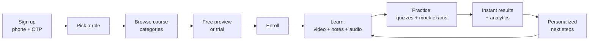

# Gurukul Next
**A unified web & mobile platform for structured, expert-led learning and exam preparation**

Gurukul Next is a product concept and implementation brief for a connected learning and exam-preparation platform.

---

## Table of Contents
1. [Overview](#overview)
2. [The Problem](#the-problem)
3. [The Idea](#the-idea)
4. [How It Works](#how-it-works)
5. [Key Features](#key-features)
6. [User Roles](#user-roles)
7. [Web & Mobile Experience](#web--mobile-experience)
8. [Suggested Course Structure](#suggested-course-structure)
9. [High-Level Architecture](#high-level-architecture)
10. [Business Model](#business-model)
11. [What Could Set This Apart](#what-could-set-this-apart)
12. [Roadmap](#roadmap)
13. [MVP Definition](#mvp-definition)
14. [Success Measures](#success-measures)
15. [Open Decisions](#open-decisions)
16. [Vision](#vision)

---

## Overview

Gurukul Next is a combined web and mobile learning platform built around one idea: students shouldn't have to piece together video lessons, notes, and practice questions from five different places. Everything a learner needs to prepare for a school exam, a university entrance test, or a competitive government exam lives in one connected experience — taught by real instructors, backed by real practice, and tracked over time so a student always knows what to study next.

The concept is inspired by the structure and mechanics of established course and exam-prep platforms in South Asia — Ambition Guru (Nepal) in particular — reimagined here as an original, standalone product concept rather than a copy of any existing app.

## The Problem

- Study material is scattered across YouTube channels, PDFs, private tutors, and outdated books, with no single trusted source.
- Strong instructors aren't evenly distributed — students outside major cities often have limited access to good teaching for competitive exams.
- Practice is inconsistent: without timed, exam-realistic mock tests, students walk into the real exam without knowing their pace or weak spots.
- Progress is invisible: students rarely get a clear, data-backed picture of what to study next, so revision time gets wasted on topics they've already mastered.

## The Idea

Bring structured courses, expert video instruction, notes, audio revision, timed practice tests, and progress analytics into one connected experience — synced across web and mobile — so a student can study from a desk in the evening and from a phone during a commute, without losing their place.

## How It Works

The platform runs on a simple, repeating loop: **enroll → learn → practice → improve.**

1. **Sign up in under a minute.** A student registers with just a phone number and a one-time password — no long forms. They pick a role (student, parent, or instructor) so the app can tailor what they see next.
2. **Browse structured categories.** Courses are organized by exam or grade level — school subjects by grade, entrance-exam tracks, government-exam prep — rather than one long unsorted list.
3. **Try before buying.** Every course opens with a short free preview or trial period, so a student can judge the teaching style and content depth before paying anything.
4. **Enroll.** Once convinced, the student buys the course outright or unlocks it through a subscription; enrollment immediately opens the full syllabus for that course.
5. **Learn through multiple formats.** Each topic is covered by a recorded (and sometimes live) video lesson, a written note summarizing the key points, and an audio version for revising without a screen.
6. **Practice under real conditions.** Short quizzes follow each topic to check understanding right away; ahead of exams, full-length mock tests run on a timer and mirror the real exam's question mix and difficulty.
7. **See results immediately.** Every test returns a score, a worked solution for each question, an accuracy breakdown by subject and topic, and how the student ranks against peers.
8. **Get told what to do next.** Performance data feeds a simple recommendation — which topics to revisit, which mock test to take next, or when to message an instructor for help — closing the loop back into learning.

This mirrors, in spirit, the enroll → live/recorded classes → notes/audio → timed mock tests → scorecards → guidance loop found in existing exam-prep apps, streamlined here into one connected experience across web and mobile.

## Key Features

### 📚 Learning Content
- Live and recorded video lessons taught by subject-expert instructors
- Chapter-wise written notes that match the video syllabus
- Audio lessons for revision without a screen — commuting, chores, downtime
- Courses mapped directly to real syllabi (school boards, entrance exams, government exams)

### 📝 Practice & Assessment
- A large, tagged question bank organized by subject, topic, and difficulty
- Short topic quizzes after each lesson for immediate understanding checks
- Full-length, timed mock exams that mirror the real test's format and pacing
- Instant scoring with step-by-step solutions, not just a final number
- Periodic quizzes or contests with small incentives to build a daily study habit

### 📊 Progress & Personalization
- A personal dashboard showing strengths, weak topics, and trend over time
- Subject-wise accuracy breakdown after every test
- Peer leaderboards and rank estimates for competitive exams
- Simple, data-backed "what to study next" guidance instead of generic advice

### 🌐 Access & Support
- One account, fully synced across the web app and the mobile apps
- Downloadable lessons and notes for low-connectivity areas
- Direct doubt-clearing — students can message instructors or post in a subject forum
- Optional parent view so a guardian can follow a child's progress and test results

## User Roles

| Role | What they do |
|---|---|
| **Student** | Browses, enrolls, learns, and practices |
| **Instructor ("Guru")** | Uploads lessons and notes, builds question banks, runs live sessions, answers doubts |
| **Parent / Guardian** | Optionally linked to a student account to view progress — not to control it |
| **Admin / Content Team** | Manages the course catalog, approves content, moderates the platform |

## Web & Mobile Experience

The two platforms are complementary rather than duplicates of each other:

- **Web app** — better suited to long study sessions, browsing the full course catalog, reading notes side-by-side with a video, and handling payments.
- **Mobile app (iOS & Android)** — built for daily use: short lessons, quick quizzes, reminders, downloaded content for offline study, and audio lessons for on-the-go revision.
- **Shared account** — progress, test history, and downloaded content stay in sync no matter which device a student picks up.

## Suggested Course Structure

- School curriculum, organized by grade
- National school-leaving exam preparation
- Higher-secondary science and management streams
- University entrance tests (medical, engineering, management)
- Government and public-service exam preparation
- Professional certification and short skill courses

## High-Level Architecture

A starting point for a technical discussion, not a final spec:

- **Client layer** — a responsive web app plus native iOS/Android apps sharing one design system and API.
- **API layer** — a central backend handling authentication, the course catalog, content delivery, test-taking, and analytics, so both clients stay in sync.
- **Content delivery** — video streaming/CDN for lessons, with a download manager for offline packages on mobile.
- **Data layer** — stores user profiles, course and content metadata, the question bank, and every test attempt and result.
- **Admin/CMS** — the tool instructors and the content team use to upload lessons, notes, and build out question banks without needing engineering help.

## Business Model

- Free preview or short trial on every course, so students try before they pay
- One-time purchase per course, or bundle pricing across a category (e.g. a full exam-prep package)
- An optional subscription tier for students who want unlimited mock tests and live classes across subjects
- A possible marketplace add-on for physical books or printed materials

## What Could Set This Apart

Worth deciding early which of these to lean into:
- Broader subject or language coverage than existing platforms in the space
- Stronger offline support for students in low-connectivity areas
- Deeper, more actionable analytics rather than just a raw score
- A genuinely active doubt-clearing community, not just a one-way content feed

## Roadmap

| Phase | Focus | Key Deliverables |
|---|---|---|
| **Phase 1 — Foundation** | Core course experience | Course catalog, video lessons, notes, basic web + mobile apps, phone/OTP signup |
| **Phase 2 — Practice Engine** | Assessment | Topic quizzes, timed mock exams, instant scoring, worked solutions |
| **Phase 3 — Personalization** | Data & guidance | Performance dashboard, weak-area detection, "study next" recommendations |
| **Phase 4 — Community & Scale** | Growth | Live classes, doubt-clearing forum, parent view, offline downloads, more exam categories |

## MVP Definition

The first release should prove that a learner can discover a course, complete a lesson, practice what they learned, and understand what to do next.

### In scope

- Phone-number and OTP authentication
- Student and instructor accounts
- Course catalog with categories, search, previews, and enrollment
- Recorded video lessons with downloadable notes
- Topic quizzes with immediate scoring and explanations
- Student dashboard with course progress and recent results
- Instructor tools for creating courses, lessons, notes, and questions
- Responsive web experience backed by a versioned API

### Deferred until after MVP

- Live classes and real-time chat
- Native mobile applications
- Offline video packages
- Parent-linked accounts
- Peer leaderboards and public rankings
- Subscriptions, contests, and physical-materials marketplace

Keeping the first release focused makes it possible to validate learning outcomes and content quality before investing in the platform's more complex social, offline, and monetization features.

## Success Measures

The product should be evaluated on learning engagement and outcomes, not registrations alone:

| Area | Initial measure |
|---|---|
| Activation | Percentage of new students who enroll in a course and start their first lesson |
| Engagement | Weekly active learners and lessons completed per active learner |
| Practice | Percentage of completed lessons followed by a quiz attempt |
| Learning progress | Improvement between a learner's first and latest attempts on comparable quizzes |
| Retention | Percentage of activated learners who return in the following week and month |
| Content quality | Lesson completion rate, quiz accuracy, and learner-reported usefulness |
| Instructor responsiveness | Median time to answer a learner's doubt once community support launches |

Baseline measurements should be collected during the MVP so later roadmap decisions use observed behavior rather than assumptions.

## Open Decisions

The following decisions should be resolved before implementation begins:

- Which country, curriculum, and exam category will be the initial launch market?
- Which languages are required for the first release?
- Will course access use one-time purchases, subscriptions, or both?
- Which payment provider and local payment methods are required?
- What content licensing and instructor-contract model will be used?
- How will instructor content be reviewed, versioned, and removed?
- What learner data may be shown on leaderboards, and what privacy controls are required?
- Which video hosting, CDN, analytics, and notification providers meet the expected cost and regional availability?

These choices affect the data model, compliance requirements, pricing, and the order of roadmap work.

## Vision

Education outcomes shouldn't depend on which city a student lives in or how many tutors their family can afford. Gurukul Next aims to put expert instruction, honest practice, and a clear sense of progress into one place that any student can reach from a phone — turning "I don't know what to study next" into a five-second answer.

---

---

## Status

This README is a product brief, not a production implementation. The MVP scope above is the recommended starting point for requirements, technical design, content planning, and user research.

This document is an original concept inspired by common patterns in course and exam-preparation products. It is not affiliated with, endorsed by, or copied from any specific company. Course categories, features, pricing, and business terms should be validated with learners and instructors before development begins.

## Deploy on Vercel

The Flask web app and REST API are configured for Vercel through `api/index.py` and `vercel.json`.

1. Import this repository into Vercel, or run `npx vercel` from the project root.
2. Keep the detected framework as **Other** and use the default build settings.
3. Add `GURUKUL_DEMO_OTP` as a Vercel environment variable if a non-default demo OTP is needed.
4. Deploy with `npx vercel --prod`.

The current app stores data in memory, so users, OTP sessions, tokens, and attempts reset when a serverless instance is recycled. Use PostgreSQL or MongoDB before production use. Socket.IO/WebRTC rooms and the LiveKit service should be deployed separately on a long-running host; Vercel is intended here for the Flask pages and REST endpoints.
# funi

